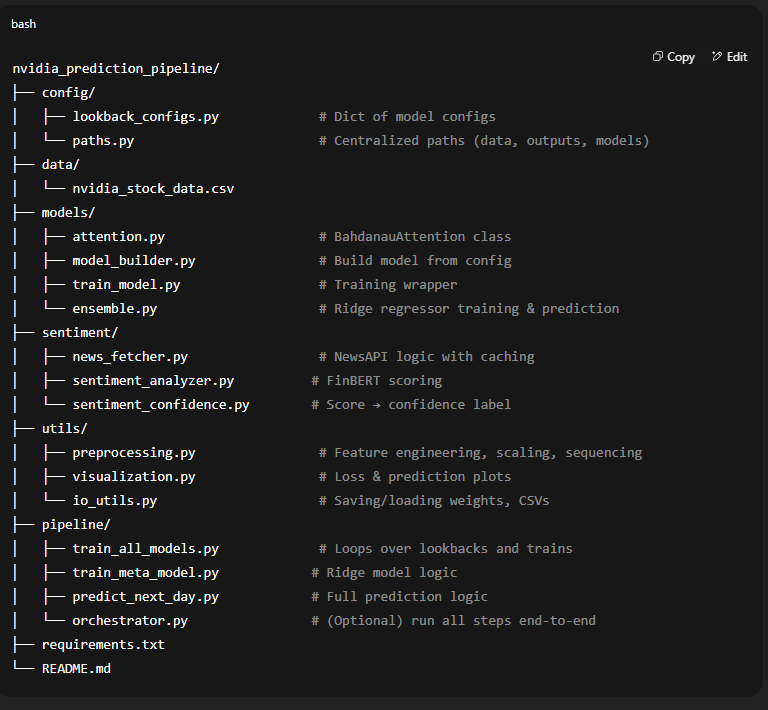

# Nvidia Stock Price Prediction Pipeline

This project predicts Nvidia's next-day closing price using a multi-model deep learning ensemble with attention mechanisms and sentiment-aware confidence scoring.

---

## Project Structure



---

## How It Works

### Step 1: Base Models

Eight GRU-based models with Bahdanau Attention are trained using different lookback windows:

* 1, 14, 30, 60, 90, 180, 270, 365 days

Each outputs predictions and loss graphs to:

```
pipeline/ensemble_inputs/{lookback}D/run_{timestamp}/
```

### Step 2: Ridge Ensemble

A Ridge regressor is trained on the latest predictions from all eight models to form a meta-model.

* Saves to `pipeline/meta_model/`

### Step 3: Sentiment-Augmented Prediction

News headlines/descriptions from the past 5 days are:

* Fetched via NewsAPI
* * Register for NewsAPI API Key: [Newsapi/Register for API Key](https://newsapi.org/register)
* Scored via FinBERT (positive, neutral, negative)
* Classified as STRONG, NEUTRAL, or WEAK confidence

Logs and prediction are stored in:

```
pipeline/meta_model/ensemble_prediction_log.csv
```

---

## Running the Pipeline

### 1. Install Dependencies

* Python==3.12.11

```bash
pip install -r requirements.txt
```

### 2. Save your NewsAPI key

```
keys/newsapi_key.txt
```

### 3. Add Nvidia Stock CSV

```
data/nvidia_stock_data.csv
```

***Update Nvidia Stock dataset with latest data.***

### 4. Run Full Pipeline

```bash
python pipeline/orchestrator.py
```

---

## Model Architecture

* GRU + Bahdanau Attention
* Dropout + Conv1D preprocessor (varies by lookback)
* Ridge ensemble regression
* FinBERT for sentiment confidence

---

## Outputs

* Prediction plots
* Loss plots
* Final predicted close with sentiment
* Logged predictions

---

## License

Apache 2.0 license

## Developer

**PJEDeveloper**
